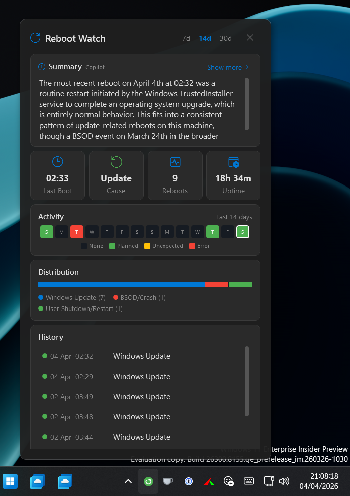
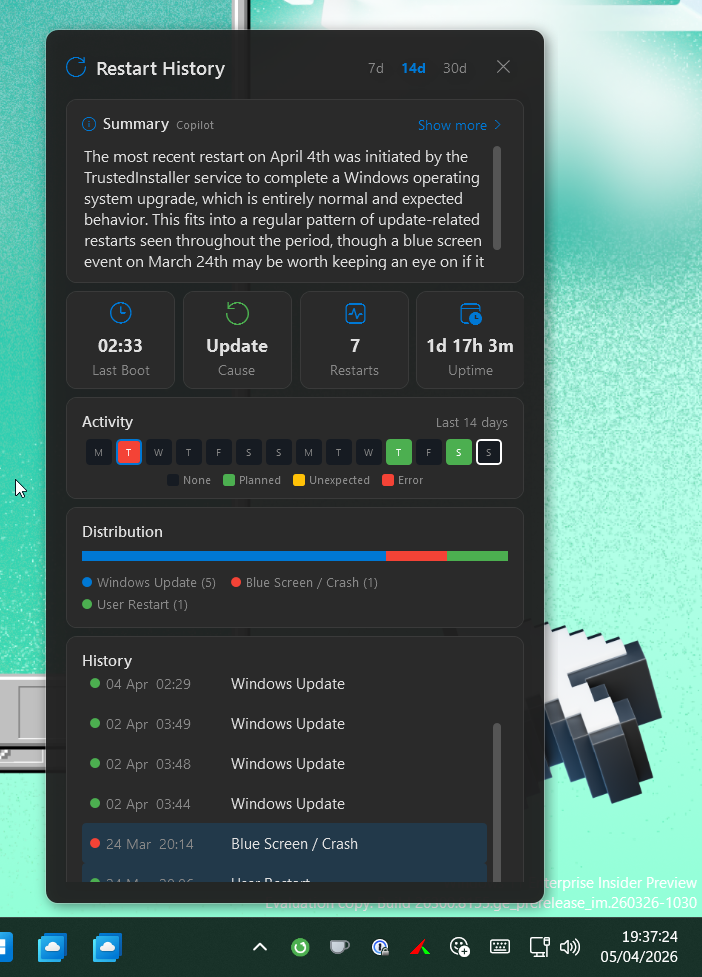
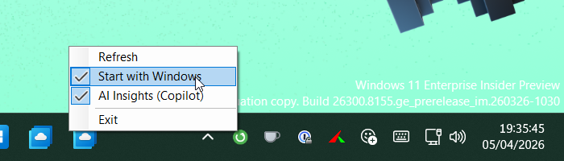
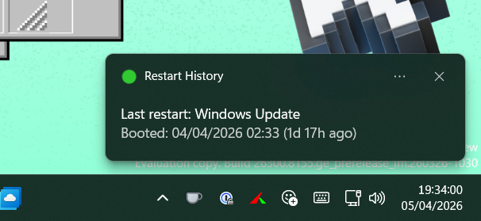
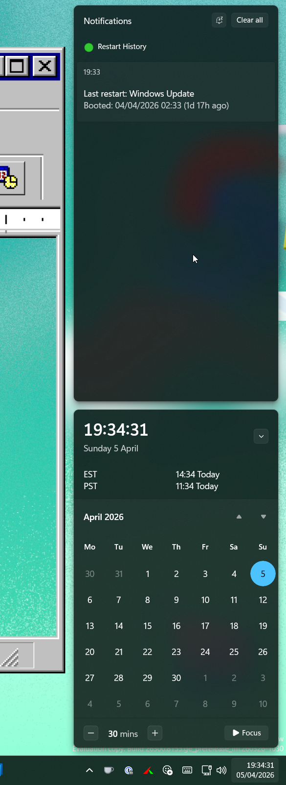
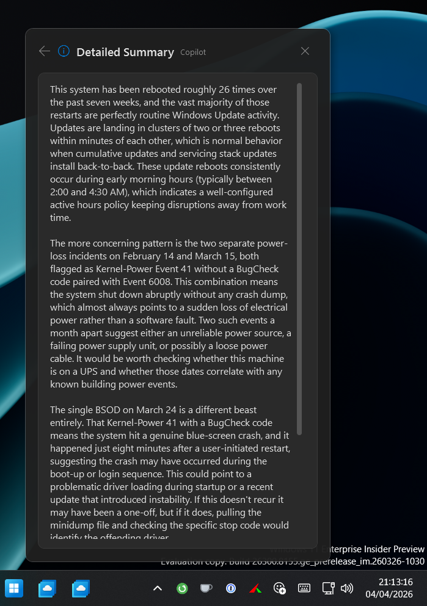
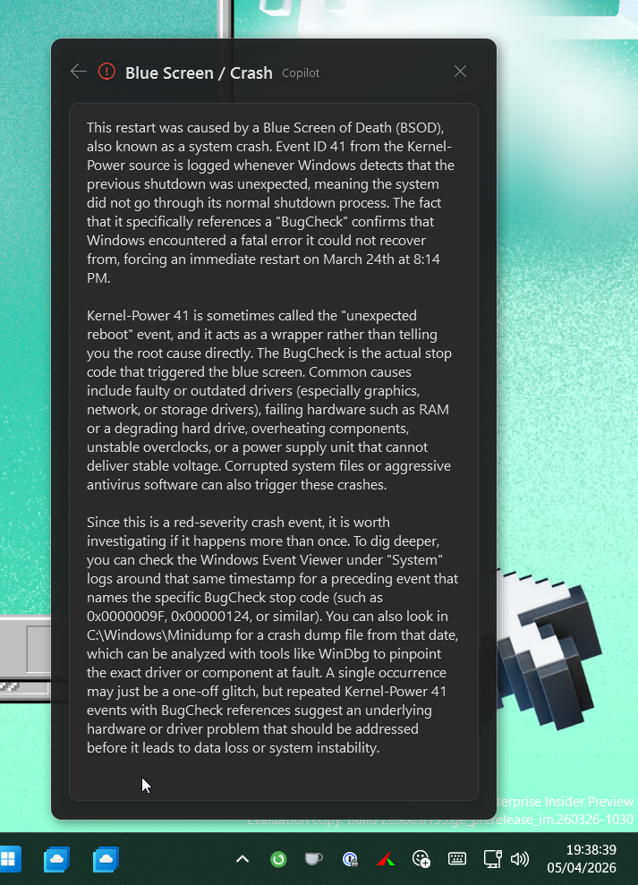

# Restart History

A lightweight Windows system tray utility that monitors your restart history, classifies causes, and surfaces patterns — without opening Event Viewer.



## Features

- **Color-coded tray icon** — green (planned), yellow (unexpected), red (blue screen/crash)
- **Dashboard flyout** — Windows 11 clipboard-style popup with stat tiles, activity strip, and history
- **Restart classification** — Windows Update, user restart, power loss, blue screen, software install, unexpected shutdown
- **Activity heatmap** — GitHub-style contribution squares showing restart frequency over 7/14/30 days
- **Cause breakdown** — visual distribution bar of restart types in the selected period
- **Toast notifications** — Windows notification on login showing last restart cause and time
- **Auto-start** — optional "Start with Windows" toggle
- **AI Insights (optional)** — Copilot-powered restart analysis with short + detailed summaries and per-event explanations

## Download

Grab the latest `RestartHistory.exe` from the [Releases](https://github.com/jcallaghan/restart-history/releases) page. No installation required — just run the exe.

## Requirements

- Windows 10 or 11 (x64)
- No admin rights required (reads System Event Log, which is accessible to standard users)
- .NET 8 SDK only needed if building from source — the published exe is self-contained

## Usage

1. Run `RestartHistory.exe`
2. A tray icon appears in the notification area (you may need to click the `^` overflow arrow)
3. **Left-click** the icon to open the dashboard flyout
4. **Right-click** for the context menu (Refresh, Start with Windows, AI Insights, Exit)

### Dashboard

| Tile              | Description                          |
| ----------------- | ------------------------------------ |
| **Last Boot**     | Time of most recent restart          |
| **Cause**         | What triggered the last restart      |
| **Restarts**      | Total count in the selected period   |
| **Uptime**        | Current session uptime               |

The **Activity** strip shows a heatmap of restarts. Click any colored square to scroll to and highlight matching history items.



The **History** list shows each restart with a severity dot, timestamp, and cause label. Click yellow/red items for an AI-powered explanation (requires Copilot — see below).

### Tray options



### Toast notification

|                                 |                                                       |
| ------------------------------- | ----------------------------------------------------- |
|  |  |

## AI Insights (GitHub Copilot)

Restart History optionally integrates with the [GitHub Copilot SDK](https://github.com/github/copilot-sdk) to provide AI-powered analysis of your restart history. This feature is **completely optional** — the app works fully without it.

### What it does

- **Short summary** — A 1-2 sentence analysis of your most recent restart with context
- **Detailed summary** — Holistic analysis across all restarts covering patterns, trends, and recommendations
- **Event explanations** — Click any yellow/red history item for a Copilot-generated explanation of what happened, including error code lookups

|                                                       |                                                     |
| ----------------------------------------------------- | --------------------------------------------------- |
|  |  |

### How to enable

1. **Install the GitHub Copilot CLI**

   The Copilot CLI must be available in your PATH as `copilot` or `copilot.exe`. Install via winget:

   ```powershell
   winget install GitHub.Copilot
   ```

2. **Authenticate**

   Run `copilot auth` to sign in with your GitHub account. A GitHub Copilot subscription is required.

3. **Enable in Restart History**

   Right-click the tray icon and check **"AI Insights (Copilot)"**. The menu item only appears when the Copilot CLI is detected in your PATH.

### How it works

- Analysis runs automatically in the background on startup and on Refresh
- Results are cached in memory — opening the flyout shows results instantly
- A loading animation displays while analysis is in progress
- Per-event explanations are also cached (clicking the same item twice is instant)
- The Copilot SDK communicates via the local `copilot` CLI in stdio mode

## Build from source

```powershell
# Clone
git clone https://github.com/jcallaghan/restart-history.git
cd restart-history

# Build
dotnet build RestartHistory.sln

# Run
dotnet run --project src/RestartHistory/RestartHistory.csproj

# Publish a self-contained single-file exe
dotnet publish src/RestartHistory -r win-x64 --self-contained -p:PublishSingleFile=true -c Release -o ./publish
```

The published exe in `./publish/RestartHistory.exe` is self-contained and runs on any Windows 10/11 x64 machine without the .NET runtime installed.

## Project structure

```
restart-history/
├── src/RestartHistory/
│   ├── Models/           # RestartEvent model, cause/severity enums
│   ├── Services/         # Event log queries, boot info, Copilot SDK integration
│   ├── Views/            # WPF flyout popup (XAML + code-behind)
│   ├── Assets/           # Tray icons (green/yellow/red .ico)
│   ├── TrayApplicationContext.cs  # Tray icon, context menu, lifecycle
│   ├── Program.cs        # Entry point
│   └── App.xaml          # WPF application
├── RestartHistory.sln
└── README.md
```

## How restart classification works

Restart History reads the Windows System Event Log and classifies events:

| Event Source        | Event ID | Classification                  |
| ------------------- | -------- | ------------------------------- |
| EventLog            | 6005     | Service started (boot marker)   |
| EventLog            | 6006     | Clean shutdown                  |
| EventLog            | 6008     | Unexpected shutdown             |
| Kernel-Power        | 41       | Unexpected power loss / crash   |
| Kernel-General      | 12       | System startup                  |
| WindowsUpdateClient | 19/20    | Windows Update restart          |
| USER32              | 1074     | User-initiated shutdown/restart |
| BugCheck            | 1001     | Blue screen with stop code      |

## Contributing

Contributions welcome! Feel free to open issues or PRs.

## License

[MIT](LICENSE)
